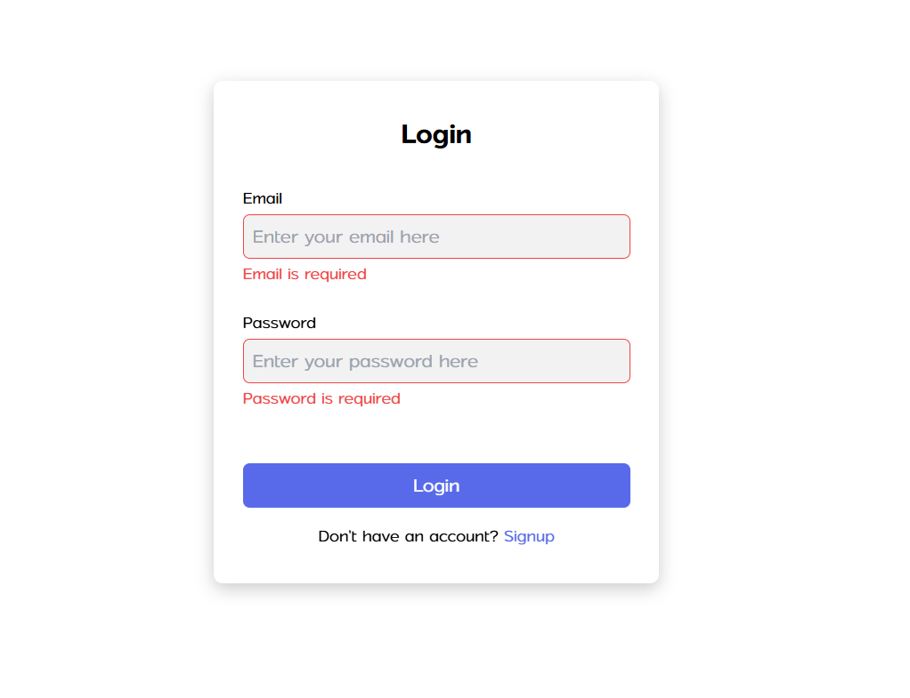
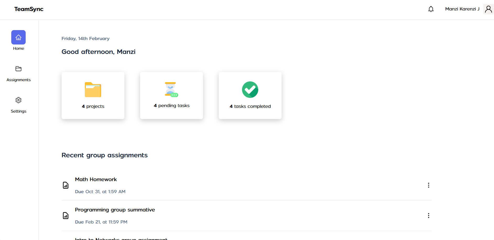
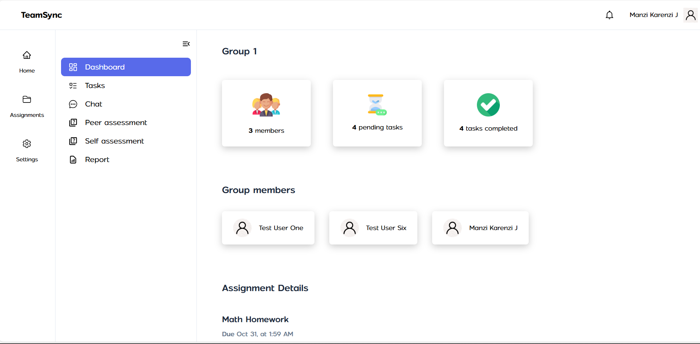
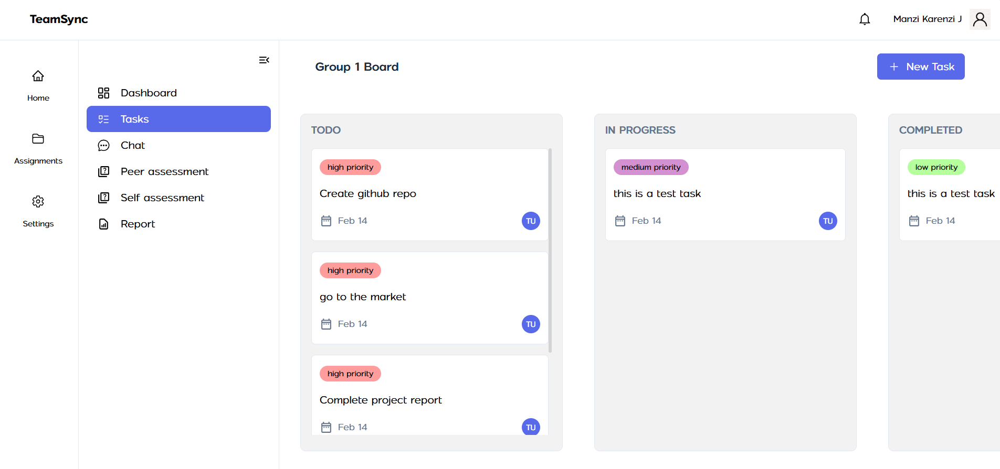
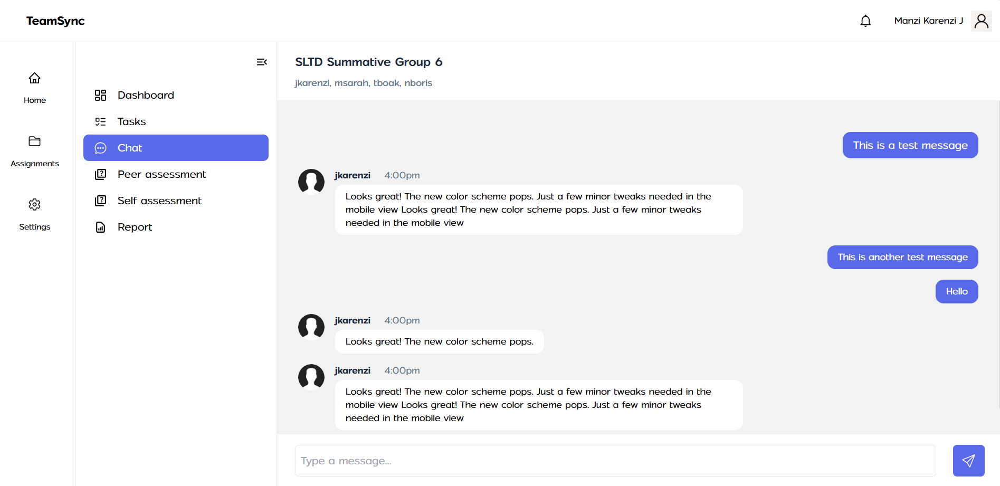
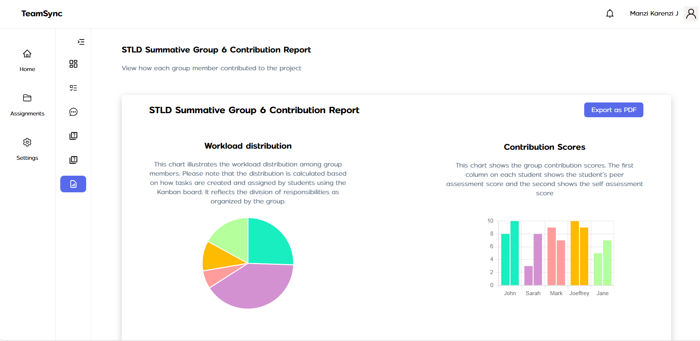

# TeamSync

TeamSync is a collaboration and contribution tracking tool designed to help teams work efficiently on group projects. It provides features for task management, group discussions, peer assessments, and contribution tracking.

## Deployed link
The backend was deployed on render, a clolud provider that offers free but limited hosting. Render is easy to setup and deploy on, however its servers spin down after 15 mins of inactivity. So this is a short term solution. After securing funds, the backend will preferably be hosted on reliable cloud providers like AWS.

The deployed link for the backend is [https://teamsync-api-cgtc.onrender.com](https://teamsync-api-cgtc.onrender.com)


## API Documentation
API swagger documentation can be found [here](https://teamsync-api-cgtc.onrender.com/docs)

## Figma Designs
The figma design is located at [https://www.figma.com/design/olVMlUwVjLK3Ieq9cH4H2m/KMJ-CAPSTONE-DESIGN?node-id=1-2&t=W0CvBWyqaWIWnedk-1](https://www.figma.com/design/olVMlUwVjLK3Ieq9cH4H2m/KMJ-CAPSTONE-DESIGN?node-id=1-2&t=W0CvBWyqaWIWnedk-1)

## Demo Video
The demo video for this assignment can be found at [https://youtu.be/l70TEHeXUCI](https://youtu.be/l70TEHeXUCI)

## Interface Screenshots







## Features
- User and group management
- Task assignment and tracking
- Group chat functionality
- Peer & Self assessments for tracking individual contributions
- Detailed reports
- Secure authentication and role-based access control

## Prerequisites
Make sure you have the following installed before proceeding:
- **Node.js** (Latest LTS version recommended)
- **Docker** (If using Docker setup)
- **PostgreSQL** (If running locally without Docker)
- **Git** (For cloning the repository)

## Installation
### 1. Clone the Repository
```sh
git clone https://github.com/jkarenzi/teamsync-be.git
cd teamsync-be
```

### 2. Set Up Environment Variables
Create a `.env` file in the root directory and add the required environment variables:
```
# Database Configuration
DB_HOST=localhost
DB_PORT=5432
DB_USER=your_db_user
DB_PASS=your_db_password
DB_NAME=teamsync_db

# JWT Secret for Authentication
JWT_SECRET=your_secret_key

# Pusher Configuration (for sockets)
PUSHER_APP_ID=your_pusher_app_id
PUSHER_KEY=your_pusher_key
PUSHER_SECRET=your_pusher_secret
PUSHER_CLUSTER=your_pusher_cluster
```

## Running the Project
### Option 1: Run with Docker (Recommended)
If you have Docker installed, you can run the project using `docker-compose`:
```sh
docker-compose up --build
```
This will start both the **PostgreSQL database** and the **Node.js backend**.

### Option 2: Run Without Docker
If you prefer to run the project without Docker, follow these steps:

1. Install dependencies:
   ```sh
   npm install
   ```

3. Start the development server:
   ```sh
   npm run dev
   ```

The server should now be running at `http://localhost:4000`.


**Happy Collaborating with TeamSync! 🚀**