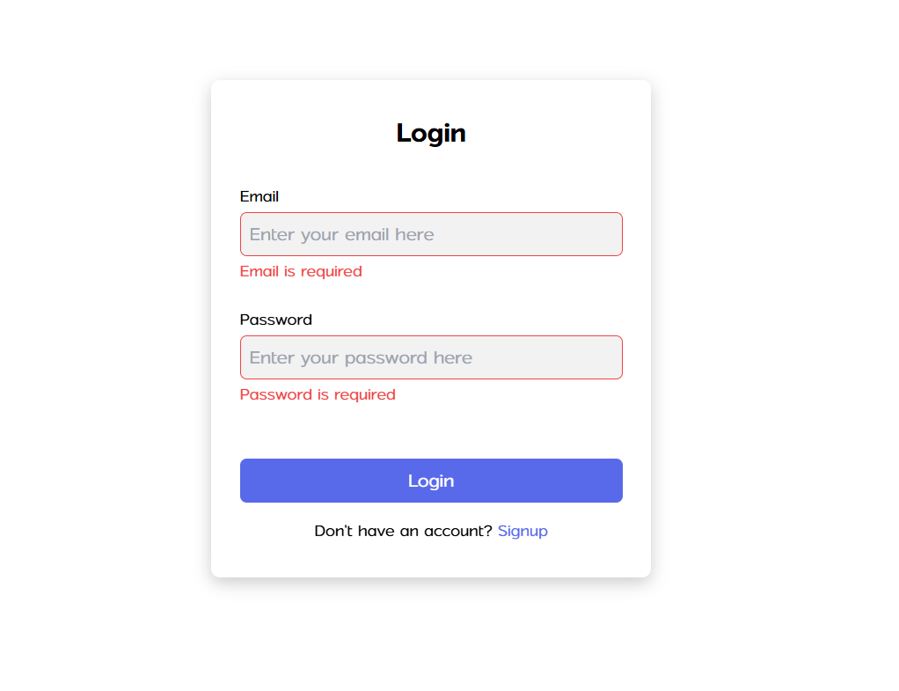
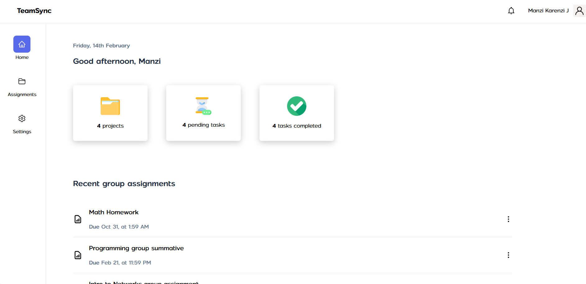
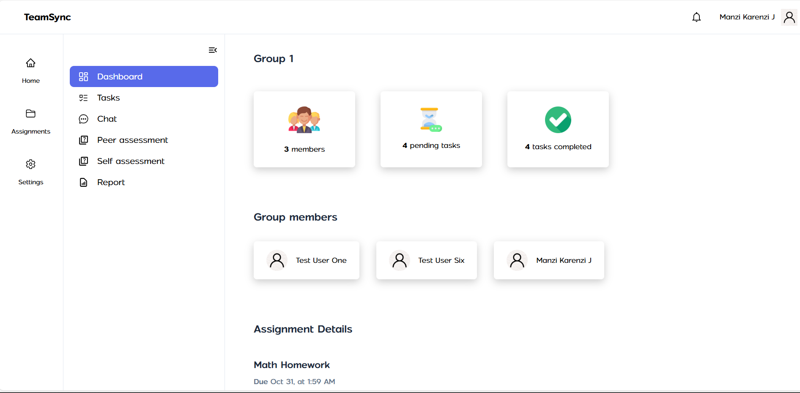
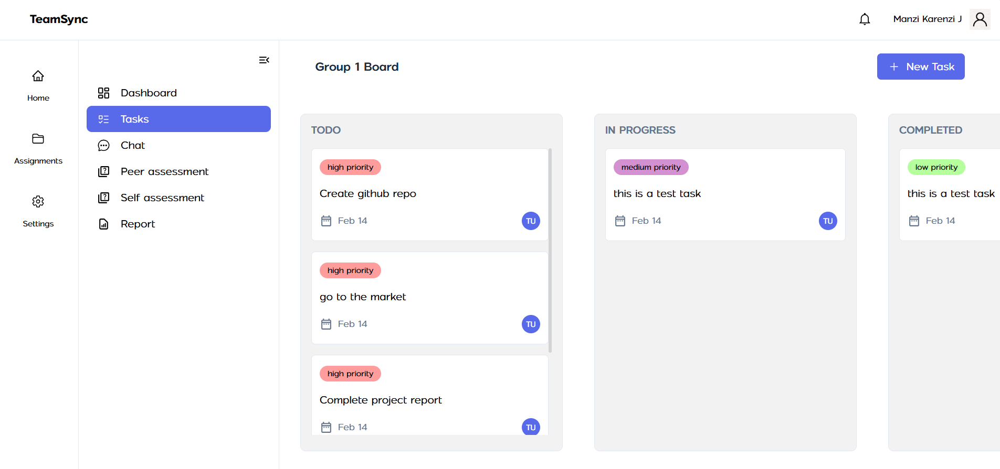
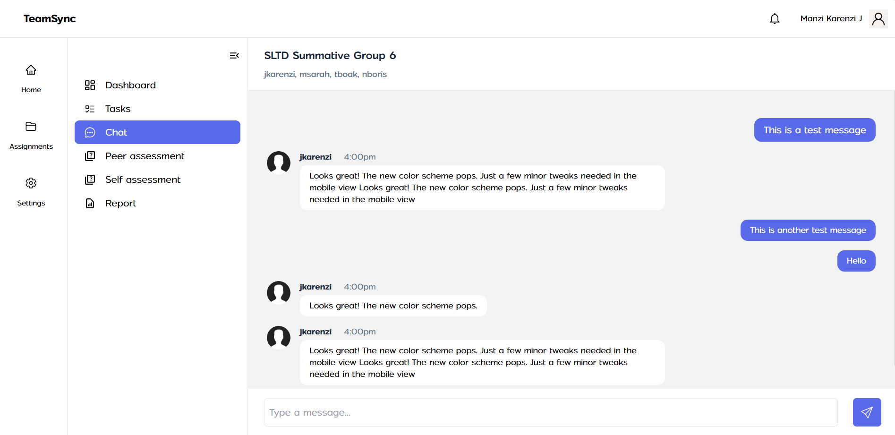
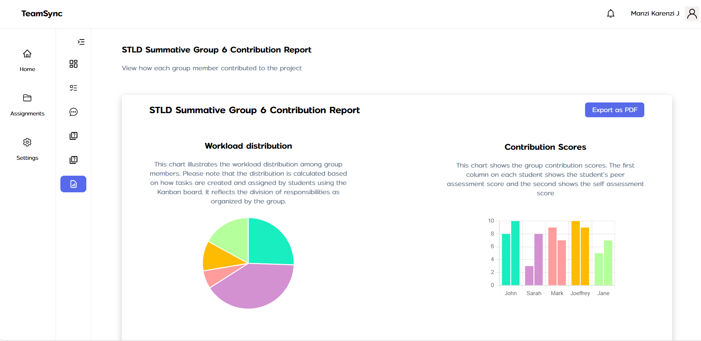

# TeamSync Frontend

TeamSync is a collaboration and contribution tracking tool designed to help teams work efficiently on group projects. It provides features for task management, group discussions, peer assessments, and contribution tracking.

## Prerequisites

Ensure you have the following installed before proceeding:

- **Node.js** (>= 16.x)
- **npm** (>= 8.x) or **yarn**

## Deployed link

The deployed link is **https://teamsync-3n5r.onrender.com**

## Figma Designs
The figma design is located [here](https://www.figma.com/design/olVMlUwVjLK3Ieq9cH4H2m/KMJ-CAPSTONE-DESIGN?node-id=1-2&t=W0CvBWyqaWIWnedk-1)

## Interface Screenshots








## Installation

Clone the repository and navigate to the project folder:

```sh
git clone https://github.com/jkarenzi/teamsync-fn.git
cd teamsync-fn
```

Install dependencies:

Using npm:
```sh
npm install
```

Using yarn:
```sh
yarn install
```

## Environment Variables

Create a `.env` file in the root directory and configure the required environment variables:

```sh
VITE_BASE_URL=
VITE_CLOUDINARY_UPLOAD_PRESET=
VITE_CLOUDINARY_NAME=
VITE_PUSHER_CLUSTER=
VITE_PUSHER_KEY=
```

## Running the Project

Start the development server:

Using npm:
```sh
npm run dev
```

Using yarn:
```sh
yarn dev
```

The app should now be running at **http://localhost:5173/** by default.

## Building for Production

To create a production build, run:

```sh
npm run build
```

This will generate an optimized `dist` folder.


## Linting

To check for linting issues, run:

```sh
npm run lint
```

## Deployment

To deploy the frontend, upload the contents of the `dist` folder to a hosting provider (e.g., Vercel, Netlify, or Firebase Hosting).